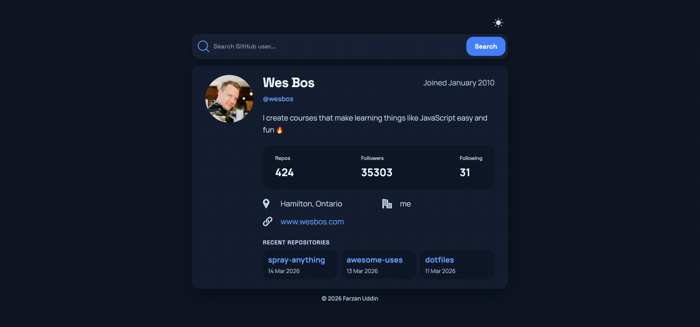

# Gituser

A GitHub profile search app built on Vite, React and Styled Components. Enter any GitHub username and instantly view their profile details.

[https://farzanuddin.github.io/gituser](https://farzanuddin.github.io/gituser/)



## Objective

Coming from a background where CRA was the go-to for spinning up React projects, Vite was pretty new
to me — I wanted to see how it handles things compared to what I was used to, whether it was easy to
set up, and how quickly I could get going with it. This project also gave me the chance to explore
hosting on GitHub Pages for the first time, figuring out how to get a frontend app deployed and live
directly through GitHub.

## Features

- Search by username — look up any GitHub user and fetch their public profile data
- Autocomplete suggestions — live username suggestions while typing in the search bar
- Profile details — displays avatar, name, bio, join date, and direct profile link
- Public stats — shows public repository count, followers, and following
- Contact fields — shows location, company, and website when available

## Tech Stack

| Technology | Version | Role |
| ---------- | :-----: | ---- |
| [React](https://react.dev/) | ^18.2.0 | UI framework |
| [Vite](https://vitejs.dev/) | ^4.4.5 | Build tool & dev server |
| [Styled Components](https://styled-components.com/) | ^6.0.6 | Component-scoped CSS-in-JS styling |
| [PropTypes](https://github.com/facebook/prop-types) | ^15.8.1 | Runtime prop type checking |
| [ESLint](https://eslint.org/) | ^8.45.0 | Code linting |
| [dayjs](https://day.js.org/) | ^1.11.9 | Lightweight date formatting and parsing |
| [Vitest](https://vitest.dev/) | ^2.1.8 | Test runner and coverage |
| [Prettier](https://prettier.io/) | ^3.8.1 | Code formatter and style enforcement |
| [jsdom](https://github.com/jsdom/jsdom) | ^24.1.3 | DOM environment for tests |

## Why This Approach

- Hook-based separation — Core search logic, network requests, caching, debouncing, and suggestion handling live in a custom hook (`src/hooks/useGithubUserSearch.js`). This keeps UI components focused on rendering while the hook owns side effects and state.

- Explicit caching & request control — An in-memory LRU-style cache with TTL plus `AbortController` prevents unnecessary network calls, provides fast cached responses, and avoids race conditions during rapid input.

- Debounced, optimistic autocomplete — Suggestions use a short debounce, separate AbortController, and their own cache to minimize API usage while keeping the UI responsive.

- Small, compositional components — UI pieces (`Search`, `Display`, `Header`, `FooterCredit`) are single-responsibility and styled via `styled-components`, improving readability and testability.

- Theming & persistence — App-level `ThemeProvider` with theme tokens and `localStorage` persistence enables consistent light/dark theming across components.

- Predictable shapes & validation — `pickDisplayUserFields` and `PropTypes` normalize and validate data from the GitHub API, reducing rendering-time surprises.

## Getting Started

1. Install dependencies:

   ```bash
   npm install
   ```

2. (Optional) Add a GitHub personal access token to raise the API rate limit from 60 to 5,000
   requests/hour:

   ```bash
   cp .env.example .env.local
   ```

   Open `.env.local` and replace `your_token_here` with a token from
   [github.com/settings/tokens](https://github.com/settings/tokens) — no scopes required. The app
   works without one.

3. Start the dev server:
   ```bash
   npm run dev
   ```

### Autocomplete Limitation

Username autocomplete uses the GitHub Search API and may stop working after a few unauthenticated
requests due to rate limiting. To increase the limit, authenticate with a GitHub personal access
token by following the existing `.env.example` setup steps in the Getting Started section.